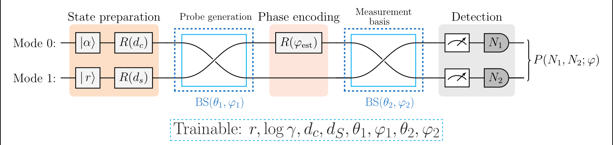

# Quantum-Enhanced Single-Parameter Phase Estimation with Adaptive NOON States

**Simanshu Kumar**<sup>1,2</sup> and **Nandan S. Bisht**<sup>1</sup>

<sup>1</sup> Department of Physics, DSB Campus, Kumaun University, Nainital, Uttarakhand, India – 263001  
<sup>2</sup> Applied Optics & Spectroscopy Laboratory, Department of Physics, SSJ University Campus, Almora, Uttarakhand, India – 263601

[](https://arxiv.org/abs/2604.12323)
[](https://doi.org/10.5281/zenodo.20041907)
[](LICENSE)

---

## Overview

This repository contains all simulation codes and figures accompanying the paper:

> **Quantum-Enhanced Single-Parameter Phase Estimation with Adaptive NOON States**  
> Simanshu Kumar and Nandan S. Bisht  
> [arXiv:2604.12323](https://arxiv.org/abs/2604.12323) [quant-ph]

We build an end-to-end **differentiable photonic circuit** that jointly optimises all eight parameters of a two-mode Mach–Zehnder interferometer (coherent + squeezed-vacuum inputs) to maximise the classical Fisher information (CFI) across all NOON-state coincidence channels for N = 2, 3, 4, 5. The optimised parameters dramatically outperform the fixed Afek et al. (Science 2010) working point.

### Key Results

| Metric | Range across N = 2–5 |
|--------|----------------------|
| Raw CFI improvement | +153% (N=2) to +1775% (N=5) |
| Post-selection rate improvement | 3× (N=2) to 10× (N=4) |
| Useful events per pulse (η<sub>Σ</sub> × P<sub>sel</sub>) | **8× to 133× improvement** |
| Probe quality (F<sub>Q</sub>/N²) | 82% of Heisenberg limit (N=2), 58% (N=5) |

---

## Repository Structure

```
.
├── noon-main.ipynb          # Main notebook: full pipeline (validation → optimisation → figures)
├── run_all.py               # Script version of the full pipeline
├── requirements.txt         # pip dependencies
├── environment.yml          # conda environment (optional)
├── noon-qfi.pdf             # Full preprint (arXiv:2604.12323v4)
├── LICENSE
└── figures/                 # All paper figures (PDF + PNG)
    ├── fig1_circuit.pdf/png         # Fig. 1  — Circuit schematic
    ├── fig8_fim_bars.pdf/png        # Fig. 2  — Raw CFI bar chart
    ├── fig2_fringe_gallery.pdf/png  # Fig. 3  — Coincidence fringe gallery
    ├── fig4_pareto.pdf/png          # Fig. 4  — Pareto trade-off plot
    ├── figW1_gallery.pdf/png        # Fig. 5  — Wigner function gallery
    ├── figW2_negativity.pdf/png     # Fig. 6  — Wigner negativity comparison
    ├── figW3_portrait.pdf/png       # Fig. 7  — Phase-space portrait (N=2)
    ├── figW4_evolution.pdf/png      # Fig. 8  — State evolution through circuit
    ├── fig3_scaling_summary.pdf/png # Fig. 9  — CFI and rate scaling with N
    ├── fig5_convergence.pdf/png     # Fig. 10 — Adam training convergence
    ├── fig6_param_drift.pdf/png     # Fig. 11 — Parameter drift from Afek init
    ├── fig7_photon_dist.pdf/png     # Fig. 12 — Marginal photon-number distributions
    └── fig_qfi.pdf/png              # Fig. 13 — QFI and measurement-efficiency analysis
```

---

## Figures

### Fig. 1 — Circuit Architecture



**8 trainable parameters:** `r`, `log γ`, `d_c`, `d_s`, `θ₁`, `φ₁`, `θ₂`, `φ₂`  
**Scanned parameter:** `φ_est` — phase to be estimated; scanned to produce coincidence fringes  
**Detection:** post-selected coincidence patterns `(N₁, N₂)` with `N₁ + N₂ = N`

The Afek et al. (Science 2010) protocol fixes these parameters analytically for single-channel optimality at each N. Our approach treats all eight as free variables and optimises jointly over all coincidence channels using Adam with automatic differentiation (Strawberry Fields TF backend).

> All remaining figures are in the [`figures/`](figures/) folder and can be browsed directly on GitHub.

---

## Installation

### Option 1 — pip (recommended)

```bash
conda create -n noon-sim python=3.10
conda activate noon-sim
pip install -r requirements.txt
```

### Option 2 — conda

```bash
conda env create -f environment.yml
conda activate noon-sim
```

### Verify

```bash
python -c "import strawberryfields; import tensorflow; print('OK')"
```

---

## Running the Code

```bash
# Run full pipeline (training + QFI + all figures)
python run_all.py
```

Or open and run all cells in `noon-main.ipynb`.

Generated figures are written to `figures/` and pickled results to the working directory.

---

## Output Files

| Output file | Content | Paper figure |
|-------------|---------|:------------:|
| `figures/fig1_circuit.pdf` | Circuit schematic (paper uses LaTeX/quantikz version) | Fig. 1 |
| `figures/fig8_fim_bars.pdf` | Raw CFI bar chart, Afek vs. optimised | Fig. 2 |
| `figures/fig2_fringe_gallery.pdf` | Coincidence fringe gallery for all N and channels | Fig. 3 |
| `figures/fig4_pareto.pdf` | Pareto trade-off: fringe quality vs. post-selection rate | Fig. 4 |
| `figures/figW1_gallery.pdf` | Wigner function gallery (all N) | Fig. 5 |
| `figures/figW2_negativity.pdf` | Wigner negativity comparison, Afek vs. optimised | Fig. 6 |
| `figures/figW3_portrait.pdf` | Phase-space portrait of quantum states (N=2) | Fig. 7 |
| `figures/figW4_evolution.pdf` | State evolution through circuit stages | Fig. 8 |
| `figures/fig3_scaling_summary.pdf` | CFI and rate scaling with N | Fig. 9 |
| `figures/fig5_convergence.pdf` | Adam training convergence curves | Fig. 10 |
| `figures/fig6_param_drift.pdf` | Parameter drift from Afek initialisation | Fig. 11 |
| `figures/fig7_photon_dist.pdf` | Marginal photon-number distributions | Fig. 12 |
| `figures/fig_qfi.pdf` | QFI and measurement-efficiency analysis | Fig. 13 |
| `all_results.pkl` | Trained parameters and full training history | — |
| `qfi_results.pkl` | QFI and η<sub>Σ</sub> × P<sub>sel</sub> for all N | — |

---

## Hardware and Runtimes

Tested on:

| Component | Spec |
|-----------|------|
| CPU | Intel Core i5, 13th Gen |
| GPU | NVIDIA GeForce RTX 3050 (6 GB VRAM) |
| RAM | 16 GB |
| OS | Arch Linux |

Typical runtimes (100 Adam steps per N):

| Step | Time |
|------|------|
| Training (N = 2–5) | ~15–20 min |
| QFI calculation (all N) | ~10–15 min |
| Wigner figures | ~3 min |
| All other figures | ~5 min |
| **Total** | **~35 min** |

---

## Citation

If you use this code or build on this work, please cite both the paper and the code archive:

**Paper:**
```bibtex
@article{kumar2026adaptive,
  title   = {Quantum-Enhanced Single-Parameter Phase Estimation
             with Adaptive {NOON} States},
  author  = {Kumar, Simanshu and Bisht, Nandan S.},
  year    = {2026},
  note    = {arXiv:2604.12323 [quant-ph]}
}
```

**Code archive (Zenodo):**
```bibtex
@software{kumar2026adaptive_code,
  author = {Kumar, Simanshu and Bisht, Nandan S.},
  title  = {Simulation code for: Quantum-Enhanced Single-Parameter
            Phase Estimation with Adaptive {NOON} States},
  year   = {2026},
  doi    = {10.5281/zenodo.20041907},
  url    = {https://doi.org/10.5281/zenodo.20041907}
}
```

---

## Acknowledgements

Simulations use [Strawberry Fields](https://strawberryfields.ai) (Xanadu Quantum Technologies) with a TensorFlow backend. Figures generated with Matplotlib. This research received no specific grant from any funding agency in the public, commercial, or not-for-profit sectors.

---

## Licence

MIT — see [`LICENSE`](LICENSE).
